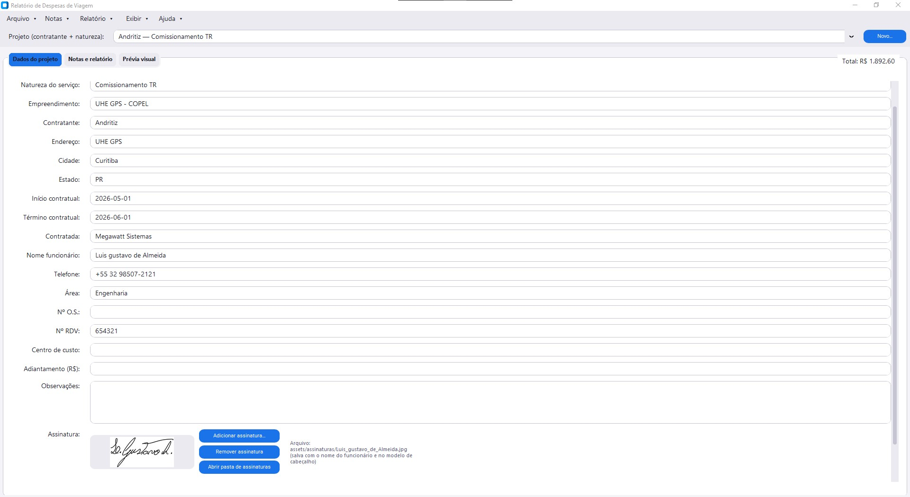
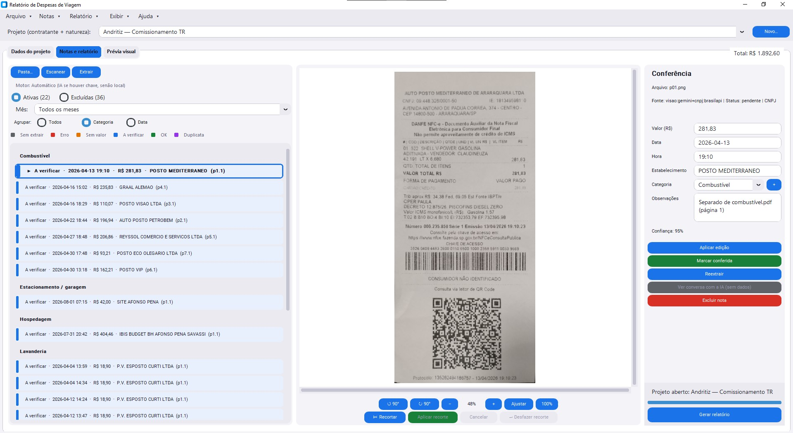
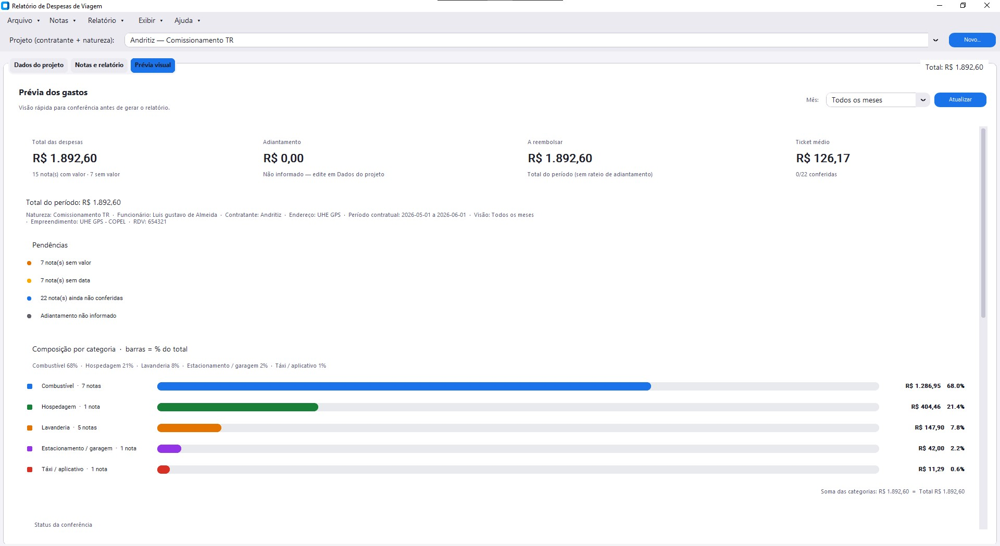

# Gerador de Relatórios de Despesa de Viagem

Programa desktop em Python para organizar as notinhas de uma viagem, ler valor, data, estabelecimento e categoria (OCR local ou IA) e montar o pacote de reembolso: planilha Excel RDV, PDF resumo e comprovantes separados por categoria.

A tela lembra o app Gerar_Relatorio: projeto no topo, trabalho em abas e opção de tema claro ou escuro.

## Telas

### Dados do projeto

Cabeçalho da viagem, observações e assinatura do funcionário.



### Notas e relatório

Lista de comprovantes à esquerda, prévia da imagem no centro e conferência à direita (zoom, recorte e correção dos campos).



### Prévia visual

Totais, adiantamento, saldo e composição dos gastos por categoria.



## O que o programa faz

- Cada viagem vira um projeto, com pasta própria para notas e relatórios
- OCR local gratuito (RapidOCR), sem internet. Se preferir, Gemini, OpenAI, Claude ou o modo Automático
- PDF com várias notas é separado sozinho
- Avisa duplicata quando data, hora, valor e estabelecimento batem
- Relatório completo, por mês ou entre duas datas
- Dá para cadastrar categorias extras nas regiões Diversas e Outros do modelo RDV
- Cabeçalho e assinatura podem ser reaproveitados entre projetos

## Pastas de um projeto

```
projetos/
  Nome_do_Projeto/
    projeto.json       # dados da viagem e das notas
    notas/             # imagens e PDFs dos comprovantes
    notas/excluidas/   # notas tiradas do relatório
    notas/_separados/  # páginas/notas tiradas de PDF
    output/            # Excel, PDF e comprovantes gerados
    meta/relatorios/   # metadados internos (não enviar)
```

Preferências, lista de projetos e cache de CNPJ ficam em `data/`:

```
data/
  user_settings.json
  projetos_registry.json
  cnpj_cache.json
  .env                 # chaves de API (não versionar)
```

Fluxo básico:

1. Arquivo → Novo projeto… (ou o botão Novo…)
2. Preencher a aba Dados do projeto
3. Abrir a pasta de notas e colocar as fotos/PDFs
4. Na aba Notas e relatório: Escanear → Extrair → conferir → Gerar relatório

O combobox no topo troca de projeto. A aba Prévia visual mostra o resumo financeiro.

## OCR e IA

Por padrão usa RapidOCR (local e gratuito). Se o Tesseract estiver instalado no Windows, ele entra como reserva quando o OCR local falha.

Em Arquivo → Configurações dá para mudar para Gemini, OpenAI, Claude ou Automático e gravar a chave.

Formatos aceitos: JPG, PNG, WEBP, HEIC/HEIF, BMP, TIFF e PDF.

### Chave do Google Gemini

1. Entre em https://aistudio.google.com/apikey com a conta Google
2. Crie uma API key
3. No programa, abra Configurações, cole a chave, escolha Google Gemini (IA) e salve

Dá para cadastrar mais de uma chave Gemini e acelerar a extração em paralelo.  
A chave fica em `data/.env` (fora do Git). Não compartilhe esse arquivo.

## Rodar em desenvolvimento

```bash
cd "Relatorio de despesa de viagem"
.\.venv\Scripts\Activate.ps1
python -m app
```

Dentro do programa: Ajuda → Manual e Ajuda → Sobre.

## Compilar para Windows (.exe)

O build gera uma pasta completa. O OCR precisa das bibliotecas ao lado do executável, então não adianta mandar só o `.exe`.

```bash
.\.venv\Scripts\Activate.ps1
python packaging\build.py
```

Saída:

- `dist/RelatorioDespesaViagem/` (pasta para usar)
- `dist/RelatorioDespesaViagem-Windows.zip` (o que distribuir)

Quem receber extrai o ZIP e abre `RelatorioDespesaViagem.exe`. Envie a pasta inteira.

Conteúdo típico da pasta:

```
RelatorioDespesaViagem/
  RelatorioDespesaViagem.exe
  projetos/
  LEIA-ME.txt
  _internal/    # oculto; motor do programa (não apagar)
  data/         # oculto; preferências e chaves
  assets/       # oculto; modelo RDV e assinaturas
```

## PDFs e categorias

PDFs na pasta de notas são separados por página e, quando dá, por várias notas na mesma página (`notas/_separados/`).

As categorias padrão estão em `config.yaml`. Categorias extras: Relatório → Gerenciar categorias extras…

## Estrutura do repositório

```
app/           # código
docs/telas/    # capturas usadas neste README
packaging/     # build PyInstaller e LEIA-ME.txt
assets/        # tema, modelo RDV, Manual e Sobre
data/          # estado local (gitignored)
projetos/      # uma pasta por viagem (gitignored)
config.yaml
```
